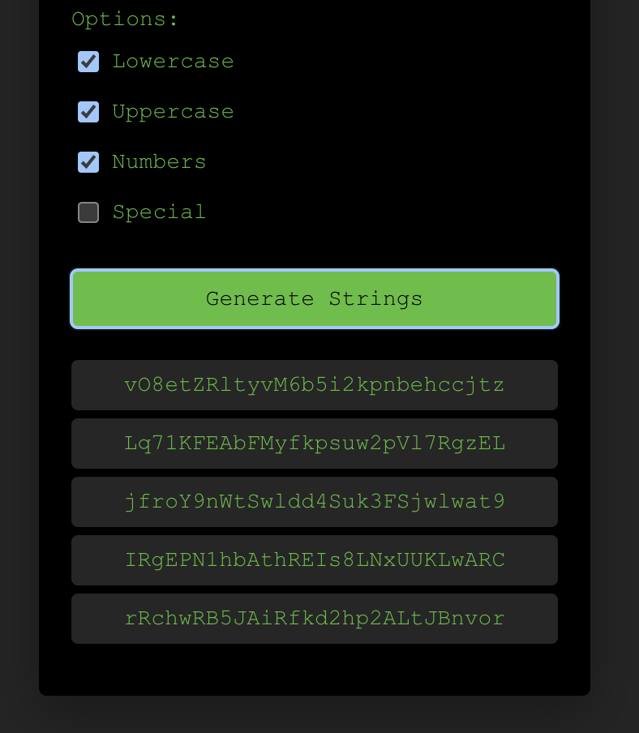
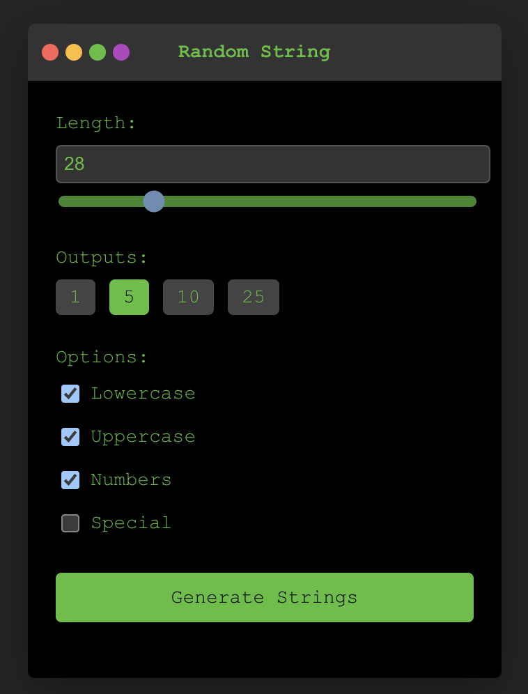

# Random String Generator Extension

A Chrome extension to generate random strings with customizable options. Easily generate strings of various lengths and character sets with a click-to-copy feature.

## Features

- Generate random strings with customizable lengths and character sets.
- Options to include lowercase, uppercase, numbers, and special characters.
- Select the number of outputs and length of the strings.
- Change the theme color with the color toggles.
- Copy generated strings to clipboard with a single click.

## Screenshots

### Main Interface

### Results

## How to Use

1. Open the extension from the Chrome toolbar.
2. Select the desired options for string generation.
3. Click "Generate Strings" to create random strings.
4. Click on any string to copy it to the clipboard.

## Installation

1. Download or clone this repository.
2. Open Chrome and navigate to `chrome://extensions/`.
3. Enable "Developer mode" in the top right corner.
4. Click "Load unpacked" and select the project directory.
5. The extension will now appear in your toolbar.

## License

This project is licensed under the MIT License.
